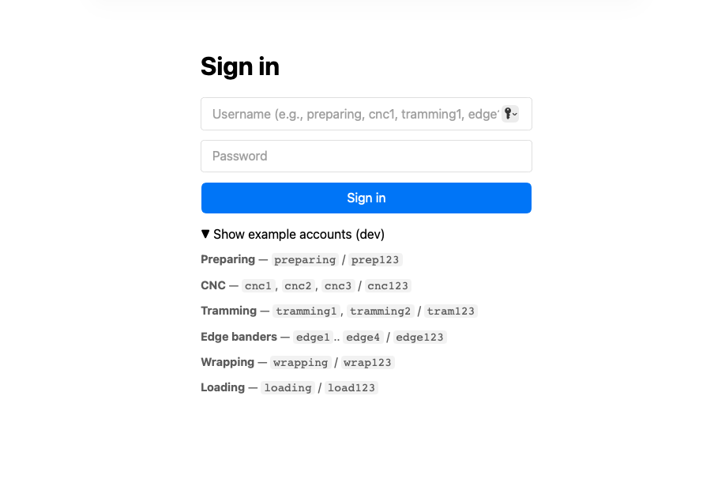
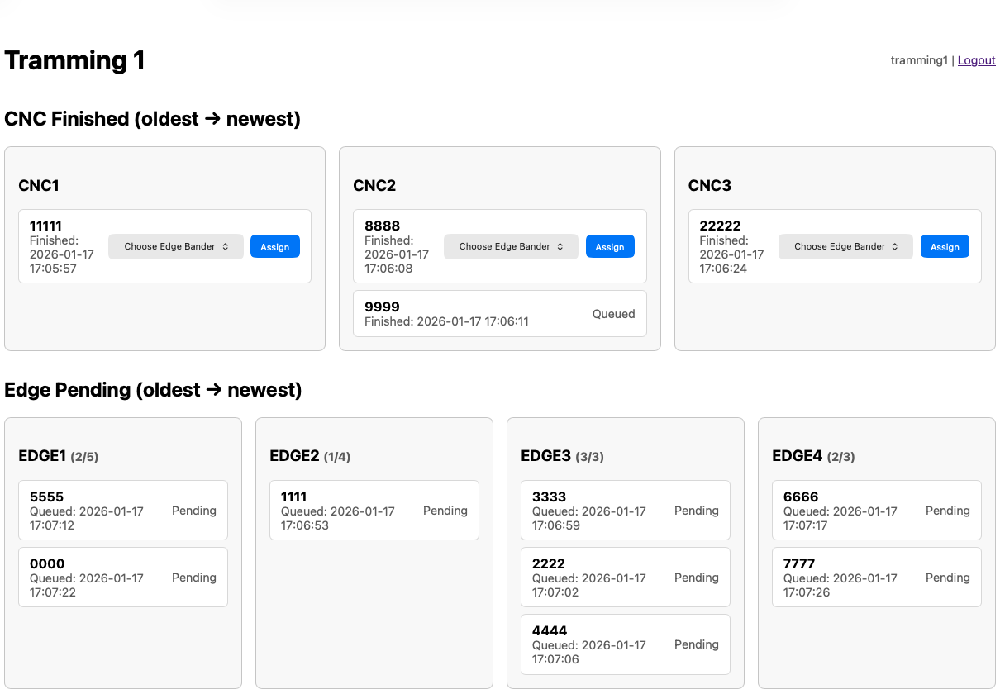
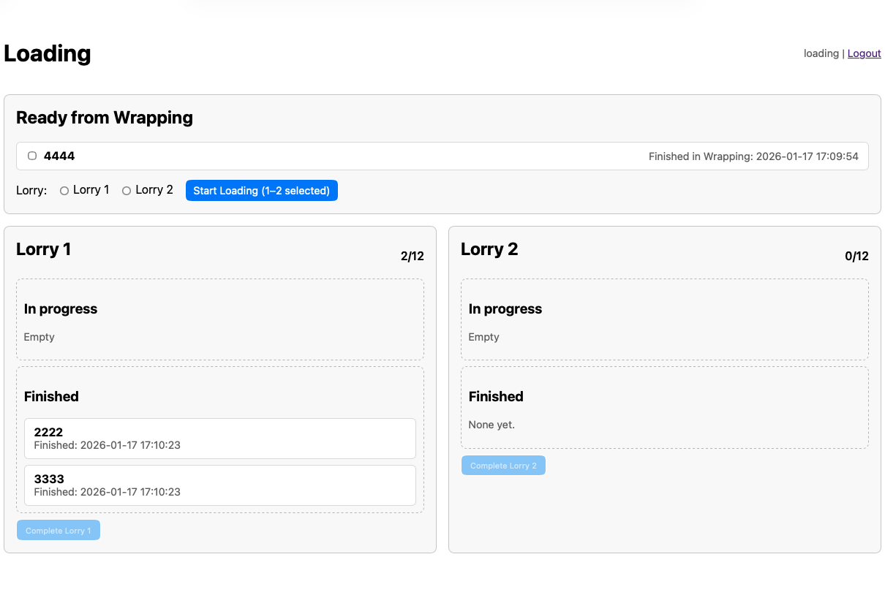
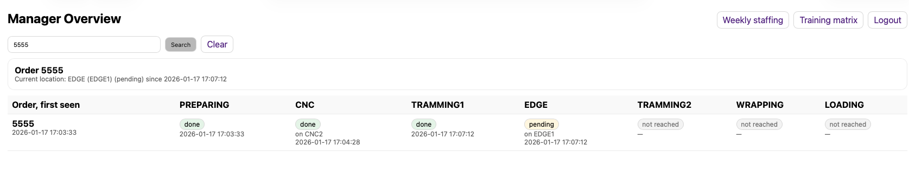

# ProductionTracker (Prototype)

This repository contains a Production Tracking prototype built using Python, Flask, and SQLite. The app simulates a production line where each station updates the status of an order, and a Manager view provides a live overview and search to quickly find where an order currently is.

This was built as an early prototype for later testing and feedback, but it was never deployed.

## Overview

The ProductionTracker provides a web interface where you can:
- Log in to individual production stations (Preparing, CNC, Tramming, Edge, Wrapping, Loading)
- Add orders and move them through the production workflow
- Enforce realistic constraints (queue limits, wrapping slots, lorry capacity)
- Use the Manager overview to monitor all active orders
- Search for an order number to instantly see its current location
- Track status changes through an order history log

## Features

- **Station-based workflow**
  - Each station has its own login and screen
  - Orders move through stations based on status updates

- **Manager overview and search**
  - Live overview table of orders across the workflow
  - Search by order number to find the current location instantly
  - CNC and Edge are grouped in the Manager view (multiple machines shown as one column, with machine detail)

- **Constraints to simulate real production**
  - Preparing queue capacity for CNC assignment
  - Edge bander capacity limits
  - Wrapping slot allocation (1–3)
  - Loading split into two lorries with capacity tracking

- **Order history**
  - Status updates are logged to support timeline and “latest status per station”

## Workflow

Preparing → CNC → Tramming 1 → Edge → Tramming 2 → Wrapping → Loading → Completed

## Requirements

- Python 3.x

Python packages (installed via `requirements.txt`):
- `Flask`
- `Werkzeug`

## Setup

1. **Clone the repository**
   ```bash
   git clone https://github.com/Myszanik/ProductionTracker.git
2. **Navigate to the Project Directory**
   ```bash
   cd ProductionTracker
3. **Create a virtual environment (recommended)**
   ```bash
   python -m venv .venv
4. **Activate the virtual environment**
   ```bash
   source .venv/bin/activate
5. **Install Dependencies**
   ```bash
   python -m pip install -r requirements.txt
6. **Run the Application**
   ```bash
   python app.py
7. **Open the app**
   ```bash
   http://localhost:5050

## Demo logins (testing only)

This project was never deployed. The login accounts exist only to simulate separate station screens during local testing.
Manager:
- manager / manager123
Stations:
- preparing / prep123
- cnc1, cnc2, cnc3 / cnc123
- tramming1 / tram123
- edge1, edge2, edge3, edge4 / edge123
- tramming2 / tram123
- wrapping / wrap123
- loading / load123

## Notes

- `orders.db` is created locally on first run and is not included in the repository.
- Demo usernames and passwords are for testing only.
- `.env.example` is included as an optional reference, the app uses a Flask secret key for sessions.

## Screenshots

### Role-based login (dev demo accounts)


### Tramming station dashboard


### Loading workflow (lorry assignment)


### Full production overview


### Manager overview (search and trace an order)


## Work in progress

Some additional pages were started for future KPI reporting and management tools:
- admin
- analytics
- downtime
- training matrix
- weekly staffing
- order timeline

## AI Usage

See `AI_USAGE.md` for how AI was used during development.

## License

All rights reserved. Shared for viewing and evaluation purposes only.

## Status

This project is a prototype for learning and portfolio purposes. Improvements and clean-ups are welcome.